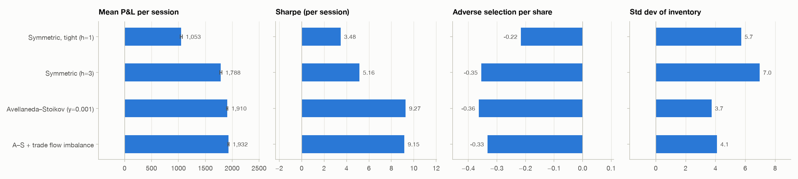
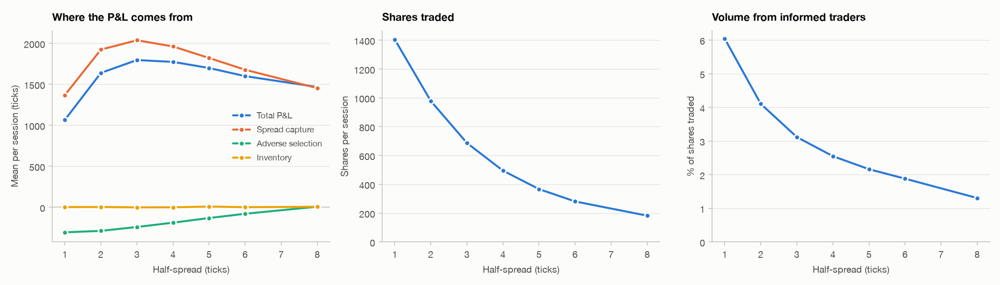
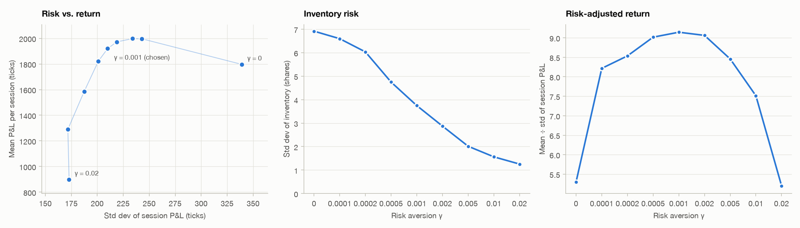
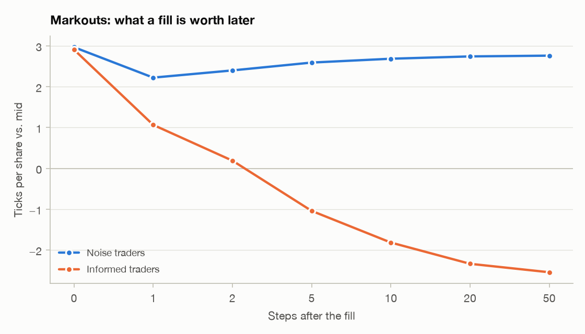
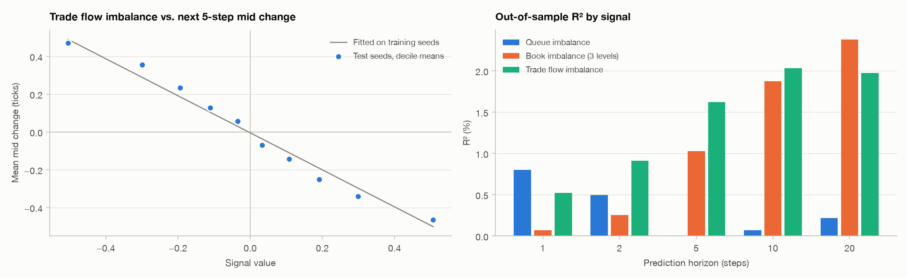
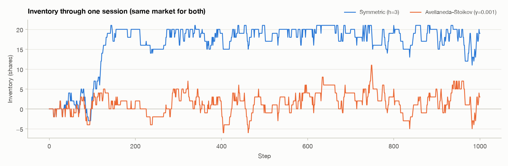

# Limit Order Book & Market-Making Simulator

An agent-based exchange simulator for studying how a market maker makes and loses money. It covers
earning the bid-ask spread, getting picked off by informed traders (**adverse selection**), managing
**inventory risk** with the Avellaneda–Stoikov model, and using short-term **order flow signals** to
quote better.

Everything is measured with an exact P&L decomposition and evaluated on fresh simulated sessions
that were never used for tuning.



## Key results

1,000 out-of-sample sessions of 1,000 steps each, run on the same seeds for every strategy. P&L is in ticks.
Full tables are in [`docs/results.md`](docs/results.md).

| Strategy | Mean P&L / session | Sharpe (per session) | Inventory std (shares) | Adverse selection / share |
|---|---|---|---|---|
| Symmetric, tight (half-spread 1) | 1,053 ± 19 | 3.48 | 5.7 | −0.216 |
| Symmetric (half-spread 3, tuned) | 1,788 ± 21 | 5.16 | 7.0 | −0.355 |
| Avellaneda–Stoikov (γ = 0.001) | 1,910 ± 13 | 9.27 | 3.7 | −0.364 |
| A–S + trade flow imbalance signal | 1,932 ± 13 | 9.15 | 4.1 | −0.333 |

- **Spread choice matters most.** Quoting 1 tick from the mid trades twice as much as quoting 3 ticks away,
  but earns 41% less. Most of the extra fills are too cheap to cover adverse selection.
- **Inventory control roughly doubles risk-adjusted return.** Avellaneda–Stoikov cut inventory volatility by
  47% and raised Sharpe from 5.2 to 9.3, while also earning more: +122 ticks per session, paired t = 13.6.
- **Trade flow imbalance predicts short-term reversals.** It explained 1.6% of 5-step mid-price moves on held-out
  data (t = −57). Leaning quotes against recent flow cut adverse selection per share by 9% (paired t = 27)
  and added +22 ticks per session, but did not improve Sharpe.

## How it works

| Stage | Module | What it does |
|---|---|---|
| 1. Exchange | [`order_book.py`](mmsim/order_book.py) | Price-time priority matching; limit, market, IOC and cancel orders on integer ticks |
| 2. Market | [`market.py`](mmsim/market.py), [`simulator.py`](mmsim/simulator.py) | Hidden random-walk true value, a lagging consensus, liquidity providers that fade stale quotes, noise traders and informed traders |
| 3. Market makers | [`strategies.py`](mmsim/strategies.py) | Symmetric quoting, Avellaneda–Stoikov inventory skew, and A–S plus a short-term signal |
| 4. Analysis | [`analytics.py`](mmsim/analytics.py), [`research.py`](mmsim/research.py) | P&L attribution, markouts, paired comparisons, signal regressions with train/test splits |
| 5. Experiments | [`scripts/run_experiments.py`](scripts/run_experiments.py) | Runs every experiment in parallel and writes the figures and [`docs/results.md`](docs/results.md) |

### P&L attribution

Every fill is split into parts that add up **exactly** to the final P&L (a unit test checks this):

```
spread capture     = s × (reference mid − fill price)     what the quote earned vs. the mid
adverse selection  = s × (true value − reference mid)     how wrong the mid was, in the direction of the fill
inventory          = Σ inventory_t × (V_t+1 − V_t)        gains and losses from holding a position
```

where `s` is +quantity for a buy and −quantity for a sell.

### Methodology

- **Common random numbers.** All randomness for a session is drawn from its seed before the session starts, so
  every strategy faces the identical market. Comparisons use paired differences, which cancel shared luck.
- **No tuning on test data.** Seeds are split into tuning (choose spread, γ, signal strength), research
  (fit signals on train seeds, score on test seeds) and evaluation (final comparison, run once).
- **Honest statistics.** 95% confidence intervals, paired t-statistics, and non-overlapping windows for signal
  regressions so autocorrelation doesn't inflate t-stats.

## Figures

| | |
|---|---|
|  |  |
|  |  |



## Running it

```bash
python3 -m venv .venv
.venv/bin/pip install -e ".[dev]" matplotlib
.venv/bin/pytest                                         # tests
.venv/bin/python scripts/run_experiments.py --sessions 50   # quick run (~10 s)
.venv/bin/python scripts/run_experiments.py                 # full run, 1,000 sessions (~3 min on 10 cores)
```

## Lessons

Written alongside the code, one per stage:

1. [The order book](docs/lessons/01-order-book.md): matching, priority, market impact, data structures
2. [The simulated market](docs/lessons/02-simulated-market.md): true value, trader types, calibration, common random numbers
3. [Market-making strategies](docs/lessons/03-market-making-strategies.md): the spread trade-off, inventory risk, Avellaneda–Stoikov
4. [Measuring performance and signal research](docs/lessons/04-analysis-and-research.md): P&L attribution, markouts, statistics, signals

## Limitations

This is a stylized model built to study mechanisms, not to estimate real profits.

- **No realistic costs.** There are no exchange fees or rebates, no latency, and no competing market makers racing for queue position.
- **The strategy is handed parameters.** It gets the true volatility; a real desk estimates σ and κ from data.
- **Single asset.** No hedging, so absolute Sharpe ratios are far higher than any real desk's. Compare strategies with each other, not with reality.

## References

- Avellaneda, M. & Stoikov, S. (2008). High-frequency trading in a limit order book. *Quantitative Finance* 8(3).
- Glosten, L. & Milgrom, P. (1985). Bid, ask and transaction prices in a specialist market with heterogeneously informed traders. *Journal of Financial Economics* 14(1).
- Cont, R., Kukanov, A. & Stoikov, S. (2014). The price impact of order book events. *Journal of Financial Econometrics* 12(1).
- Cartea, Á., Jaimungal, S. & Penalva, J. (2015). *Algorithmic and High-Frequency Trading*. Cambridge University Press.
