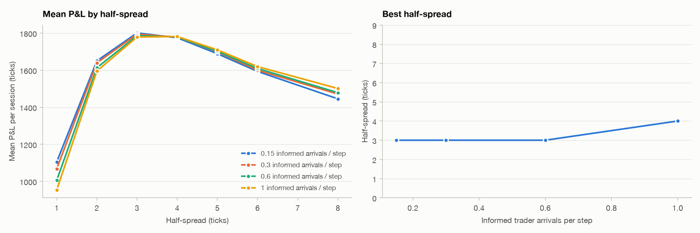

# Results

Generated by `scripts/run_experiments.py`. All P&L is in ticks, marked to the true value at the end
of each session. 1,000 sessions of 1,000 steps per strategy in each experiment.
± values are 95% confidence intervals. Sharpe is mean ÷ std of per-session P&L (not annualized).

## Market

| Parameter | Value |
|---|---|
| `n_steps` | 1000 |
| `initial_value` | 1000.0 |
| `volatility` | 0.6 |
| `consensus_speed` | 0.15 |
| `liquidity_rate` | 2.0 |
| `liquidity_offset_p` | 0.2 |
| `liquidity_max_size` | 5 |
| `liquidity_lifetime` | 20 |
| `initial_levels` | 5 |
| `noise_rate` | 1.5 |
| `noise_max_size` | 5 |
| `informed_rate` | 0.3 |
| `informed_max_size` | 8 |
| `informed_threshold` | 1.0 |

Average gap between the market mid and the true value: **1.60 ticks**.

## 1. Spread sweep: symmetric market maker (tuning seeds)

| Half-spread | Mean P&L | Spread capture | Adverse selection | Inventory | Shares/session | Informed share | Sharpe |
|---|---|---|---|---|---|---|---|
| 1 | 1,066 ± 18 | 1,369 | -306 | 3 | 1,405 | 6.0% | 3.61 |
| 2 | 1,640 ± 19 | 1,925 | -288 | 3 | 978 | 4.1% | 5.25 |
| 3 | 1,797 ± 21 | 2,038 | -241 | -1 | 687 | 3.1% | 5.30 |
| 4 | 1,774 ± 22 | 1,963 | -188 | -0 | 495 | 2.5% | 4.97 |
| 5 | 1,700 ± 23 | 1,822 | -131 | 9 | 367 | 2.2% | 4.59 |
| 6 | 1,601 ± 23 | 1,678 | -79 | 1 | 281 | 1.9% | 4.31 |
| 8 | 1,468 ± 25 | 1,454 | 7 | 6 | 182 | 1.3% | 3.71 |

Chosen half-spread (highest mean P&L): **3** ticks, so κ = 1/3.

## 2. How informed traders change the best spread (tuning seeds)

The same spread sweep at different informed trader arrival rates, 500 sessions each.

| Informed arrivals per step | Best half-spread | Mean P&L at best | Adverse selection ÷ spread capture | Informed share of volume |
|---|---|---|---|---|
| 0.15 | 3 | 1,801 ± 30 | 10% | 1.7% |
| 0.3 | 3 | 1,794 ± 31 | 12% | 3.2% |
| 0.6 | 3 | 1,787 ± 31 | 15% | 5.5% |
| 1 | 4 | 1,782 ± 32 | 14% | 6.3% |

## 3. Risk aversion sweep: Avellaneda–Stoikov (tuning seeds)

| γ | Mean P&L | Std of P&L | Sharpe | Inventory std | Mean max \|inventory\| |
|---|---|---|---|---|---|
| 0 | 1,797 ± 21 | 339 | 5.30 | 6.9 | 21.0 |
| 0.0001 | 1,996 ± 15 | 243 | 8.22 | 6.6 | 18.6 |
| 0.0002 | 1,998 ± 15 | 234 | 8.54 | 6.0 | 17.7 |
| 0.0005 | 1,972 ± 14 | 219 | 9.02 | 4.7 | 15.3 |
| 0.001 | 1,920 ± 13 | 210 | 9.14 | 3.7 | 13.4 |
| 0.002 | 1,822 ± 12 | 201 | 9.06 | 2.9 | 11.4 |
| 0.005 | 1,585 ± 12 | 187 | 8.46 | 2.0 | 9.2 |
| 0.01 | 1,290 ± 11 | 172 | 7.51 | 1.6 | 7.9 |
| 0.02 | 899 ± 11 | 173 | 5.20 | 1.3 | 6.8 |

Chosen γ (highest Sharpe): **0.001**.

## 4. Research: which signal predicts the mid?

Three candidate signals, all computed from what the market maker can see (its own quotes excluded):

- **Queue imbalance**: (bid − ask volume) ÷ total at the best bid and ask
- **Book imbalance**: the same over the top 3 price levels
- **Trade flow imbalance**: (buyer- − seller-initiated volume) ÷ total over the last 10 steps

Each signal is regressed on the future mid change: fitted on training seeds, evaluated on separate test
seeds, with non-overlapping windows. The signal is chosen by in-sample R² on the training seeds only.

| Signal | Horizon (steps) | Slope (ticks) | t-stat (train) | In-sample R² | Out-of-sample R² | Out-of-sample correlation |
|---|---|---|---|---|---|---|
| Queue imbalance | 1 | +0.29 | 91.7 | 0.8% | 0.8% | +0.090 |
| Queue imbalance | 2 | +0.28 | 49.3 | 0.5% | 0.5% | +0.070 |
| Queue imbalance | 5 | +0.07 | 6.3 | 0.0% | 0.0% | +0.010 |
| Queue imbalance | 10 | -0.16 | -8.9 | 0.1% | 0.1% | -0.027 |
| Queue imbalance | 20 | -0.41 | -13.1 | 0.3% | 0.2% | -0.048 |
| Book imbalance (3 levels) | 1 | -0.10 | -24.6 | 0.1% | 0.1% | -0.026 |
| Book imbalance (3 levels) | 2 | -0.26 | -34.8 | 0.2% | 0.3% | -0.050 |
| Book imbalance (3 levels) | 5 | -0.64 | -44.2 | 1.0% | 1.0% | -0.102 |
| Book imbalance (3 levels) | 10 | -1.02 | -42.9 | 1.8% | 1.9% | -0.137 |
| Book imbalance (3 levels) | 20 | -1.39 | -33.6 | 2.3% | 2.4% | -0.154 |
| Trade flow imbalance | 1 | -0.36 | -72.5 | 0.5% | 0.5% | -0.072 |
| Trade flow imbalance | 2 | -0.60 | -68.5 | 0.9% | 0.9% | -0.095 |
| Trade flow imbalance | 5 | -0.98 | -57.0 | 1.6% | 1.6% | -0.127 |
| Trade flow imbalance | 10 | -1.26 | -44.5 | 2.0% | 2.0% | -0.143 |
| Trade flow imbalance | 20 | -1.50 | -30.3 | 1.8% | 2.0% | -0.141 |

Chosen signal: **Trade flow imbalance**.

## 5. Signal strength (tuning seeds)

The signal market maker shifts its reservation price by `scale × -0.98` ticks per unit
of the signal (its fitted 5-step slope). Scale 0 is plain Avellaneda–Stoikov.

| Scale | Mean P&L | Sharpe | Adverse selection per share |
|---|---|---|---|
| 0 | 1,920 ± 13 | 9.14 | -0.361 |
| 0.25 | 1,933 ± 13 | 9.15 | -0.344 |
| 0.5 | 1,942 ± 13 | 9.21 | -0.331 |
| 1 | 1,954 ± 13 | 9.13 | -0.306 |
| 1.5 | 1,960 ± 13 | 9.12 | -0.280 |
| 2 | 1,957 ± 13 | 9.10 | -0.255 |

Chosen scale (highest Sharpe): **0.5**.

## 6. Final evaluation (fresh seeds, never used for tuning)

| Strategy | Mean P&L | Std of P&L | Sharpe | Win rate | Adverse selection per share | Inventory std |
|---|---|---|---|---|---|---|
| Symmetric, tight (h=1) | 1,053 ± 19 | 303 | 3.48 | 99.8% | -0.216 | 5.7 |
| Symmetric (h=3) | 1,788 ± 21 | 347 | 5.16 | 100.0% | -0.355 | 7.0 |
| Avellaneda–Stoikov (γ=0.001) | 1,910 ± 13 | 206 | 9.27 | 100.0% | -0.364 | 3.7 |
| A–S + trade flow imbalance | 1,932 ± 13 | 211 | 9.15 | 100.0% | -0.333 | 4.1 |

### Paired comparisons (same seeds, so shared market luck cancels out)

| Comparison | Metric | Mean difference | t-stat |
|---|---|---|---|
| Avellaneda–Stoikov (γ=0.001) − Symmetric (h=3) | pnl | +121.61 | 13.6 |
| Avellaneda–Stoikov (γ=0.001) − Symmetric (h=3) | inventory_std | -3.23 | -45.7 |
| A–S + trade flow imbalance − Avellaneda–Stoikov (γ=0.001) | pnl | +22.12 | 16.4 |
| A–S + trade flow imbalance − Avellaneda–Stoikov (γ=0.001) | adverse_selection | +22.85 | 27.0 |

